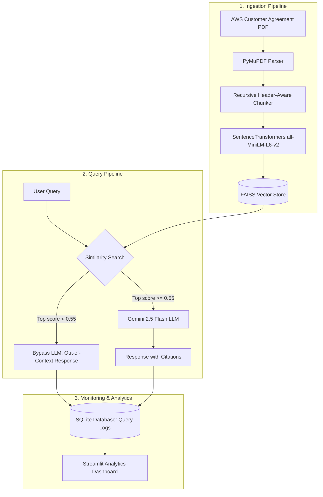

# AWS Customer Agreement RAG Assistant

A complete, production-ready, industry-level Retrieval-Augmented Generation (RAG) system built to ingest, chunk, index, search, and answer complex legal queries from the 19-page **AWS Customer Agreement** PDF.

The system features a **FastAPI backend** for high-performance API services, an embedding and local vector search database utilizing **FAISS**, and a **Streamlit frontend** with a custom dark-themed Chat Assistant and an interactive Analytics Dashboard powered by **Plotly**.

---

## Technical Architecture



---

## Folder Structure

```text
project/
├── backend/
│   ├── api/
│   │   ├── analytics.py      # Aggregated performance endpoints
│   │   ├── ask.py            # RAG QA endpoint
│   │   └── ingest.py         # PDF processing/indexing endpoint
│   ├── database/
│   │   ├── db.py             # SQLite connection & session helpers
│   │   └── models.py         # SQLAlchemy QueryLog model
│   ├── schemas/
│   │   ├── request.py        # Pydantic query schemas
│   │   └── response.py       # Pydantic response schemas
│   ├── services/
│   │   ├── analytics_service.py # Database statistics & analytics
│   │   ├── chunker.py        # Intelligent page/section recursive chunker
│   │   ├── embeddings.py     # SentenceTransformers embedding engine
│   │   ├── pdf_loader.py     # PyMuPDF PDF page & section parser
│   │   ├── rag_pipeline.py   # RAG pipeline coordinator
│   │   └── vector_store.py   # FAISS manager & similarity search
│   ├── utils/
│   │   └── logger.py         # Rich terminal and file logging config
│   ├── config.py             # Environment configurations & paths
│   └── main.py               # FastAPI application entry point
├── data/
│   └── aws_customer_agreement.pdf # Document under analysis
├── docs/
│   └── screenshots/          # Application screenshots (UI demo)
├── frontend/
│   └── app.py                # Streamlit UI (Chat Assistant & Analytics)
├── tests/
│   └── test_rag.py           # End-to-end integration and seeding script
├── .env.example              # Template for environment variables
├── .env                      # Local configuration settings (ignored by git)
└── requirements.txt          # Python packages list
```

---

## Prerequisites & Installation

### 1. Prerequisites
- Python `3.10` or higher
- A Google Gemini API Key (obtain from [Google AI Studio](https://aistudio.google.com/))

### 2. Setup environment
Clone or copy the directory and navigate to the project directory:
```bash
cd "project"
```

Create a virtual environment and activate it:
```bash
python -m venv venv
# On Windows:
venv\Scripts\activate
# On Linux/macOS:
source venv/bin/activate
```

Install requirements:
```bash
pip install -r requirements.txt
```

### 3. Configure Environment Variables
Copy `.env.example` to `.env` and fill in your Gemini API Key:
```bash
cp .env.example .env
```
Inside `.env`:
```env
GEMINI_API_KEY=your_actual_gemini_api_key_here
SIMILARITY_THRESHOLD=0.55
TOP_K=5
```

---

## Execution Guide

### 1. Run Automated Verification & Seeding
The system includes an end-to-end integration script that launches the FastAPI backend in the background, triggers document ingestion, runs 30 test queries (20 valid questions and 10 invalid out-of-context questions), logs metrics, and prints analytics summary:
```bash
python tests/test_rag.py
```
> [!NOTE]
> If a valid Gemini API key is not yet set in `.env`, the script automatically writes mocked legal responses directly to the SQLite database. This ensures your Analytics Dashboard is immediately seeded with realistic data for demo purposes!

### 2. Run Backend Server manually
To start the FastAPI server:
```bash
uvicorn backend.main:app --host 127.0.0.1 --port 8000
```
- API Docs will be available at: [http://127.0.0.1:8000/docs](http://127.0.0.1:8000/docs)
- Base endpoint health check: [http://127.0.0.1:8000/](http://127.0.0.1:8000/)

### 3. Run Streamlit Frontend
To launch the user interface:
```bash
streamlit run frontend/app.py
```
The browser will automatically open [http://localhost:8501](http://localhost:8501).

---

## API Endpoints (cURL Examples)

### 1. Document Ingestion
Ingests and indexes the default PDF (`data/aws_customer_agreement.pdf`) or accepts an uploaded file:
```bash
curl -X POST "http://127.0.0.1:8000/ingest"
```

### 2. Querying RAG
Asks a legal question about the customer agreement:
```bash
curl -X POST "http://127.0.0.1:8000/ask" \
     -H "Content-Type: application/json" \
     -d "{\"query\": \"How can I terminate the agreement?\"}"
```

### 3. Analytics Dashboard Data
Retrieves system-wide aggregations:
```bash
curl -X GET "http://127.0.0.1:8000/analytics"
```

---

## Design Justifications

| Component | Choice | Justification |
| :--- | :--- | :--- |
| **PDF Processing** | **PyMuPDF** | Significantly faster than PyPDF2/pdfplumber. Retains structural indentation, page offsets, and table layout representations. |
| **Text Chunks** | **Recursive Chunker** | Splitting text recursively (1000 char size, 200 char overlap) prevents cutting sentences. Prepending metadata (page, section headers) ensures context is not lost in retrieval. |
| **Embeddings** | **SentenceTransformers** | Runs completely locally (offline-capable) using `all-MiniLM-L6-v2` generating 384-dimensional dense vectors. High performance, zero cost, and fast execution on CPUs. |
| **Vector DB** | **FAISS** | Fast, lightweight, and saves index files locally to disk. Perfect for document-specific contexts, eliminating complex cloud vector database overheads. |
| **RAG Threshold** | **0.55 Cosine Sim** | Prevents hallucinations by calculating similarity scores. Queries scoring below `0.55` bypass Gemini API completely, saving tokens and raising system safety. |
| **Generative LLM** | **Gemini 2.5 Flash** | Advanced context reasoning, extremely fast response latency, and massive context window for grounding. |
| **SQL Database** | **SQLite (SQLAlchemy)** | Embedded SQL database with zero configuration. Standard SQL allows full aggregation queries and enables direct database queries from frontend charts. |
| **Frontend UI** | **Streamlit** | Rapidly builds beautiful, interactive web apps in python. Integrated with Plotly for dashboard charts and supports complex CSS injection for custom UI aesthetics. |
